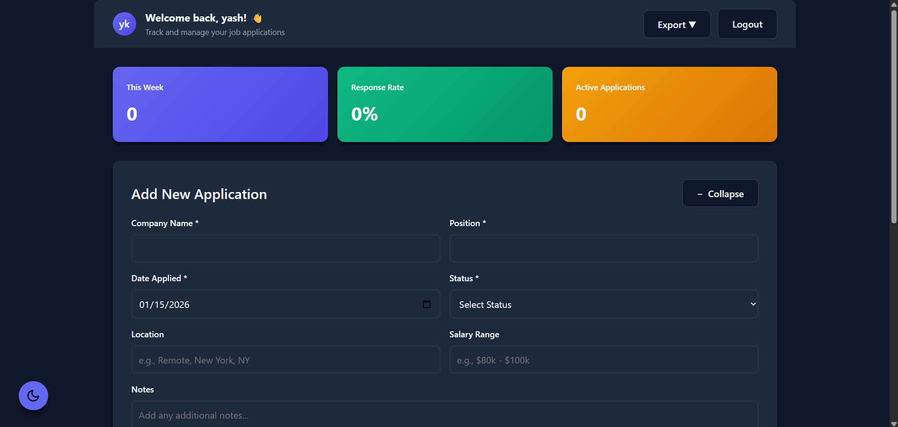

# 🎯 Job Application Tracker

A full-stack web application built with Flask to help job seekers efficiently track and manage their job applications, interviews, and offers.


## 🚀 Live Demo

**[View Live Application](https://job-application-tracker-75z1.onrender.com)** 

Try it out! Create an account and explore all features.

---

## 📸 Screenshots

### Login Page


### Dashboard (Dark Mode)


### Statistics & Application Management


### Export Features


---

## ✨ Key Features

### 🔐 **Authentication & Security**
- Secure user registration and login
- Password hashing with Werkzeug
- Session management with Flask-Login
- Password reset functionality
- "Remember me" option

### 📊 **Dashboard & Analytics**
- Real-time application statistics
- Quick stats: weekly applications, response rate, active applications
- Visual status tracking with color-coded badges
- Filterable and searchable application list

### 📝 **Application Management**
- **Create**: Add new job applications with detailed information
- **Read**: View all applications with filtering options
- **Update**: Edit existing applications inline
- **Delete**: Remove applications with confirmation

### 📤 **Export Features**
- **CSV Export**: Download all applications as spreadsheet
- **PDF Export**: Generate professional reports with statistics

### 🎨 **User Experience**
- **Dark Mode**: Toggle between light and dark themes (fully responsive)
- **Responsive Design**: Works seamlessly on desktop, tablet, and mobile
- **Real-time Updates**: Dynamic UI without page reloads
- **Form Validation**: Client and server-side validation
- **Collapsible Forms**: Clean interface with expandable sections

---

## 🛠️ Tech Stack

**Backend:**
- Flask 3.1.2 - Web framework
- SQLAlchemy 2.0 - ORM for database operations
- Flask-Login - User session management
- Flask-Migrate - Database migrations
- Werkzeug - Password hashing & security

**Frontend:**
- HTML5, CSS3, JavaScript (Vanilla)
- CSS Variables for dynamic theming
- Responsive Grid & Flexbox layouts
- No frontend framework dependencies

**Database:**
- SQLite (Development & Production)
- PostgreSQL ready (easy migration)

**Additional Libraries:**
- ReportLab - PDF generation
- itsdangerous - Secure token generation
- Gunicorn - Production WSGI server

**Deployment:**
- Render.com (Free tier)
- Automatic deployments from GitHub
- Environment variable configuration

---

## 💻 Local Installation

### Prerequisites
- Python 3.11+
- pip
- virtualenv (recommended)

### Setup Steps

1. **Clone the repository**
```bash
git clone https://github.com/yas0h00/job-application-tracker.git
cd job-application-tracker
```

2. **Create virtual environment**
```bash
python -m venv venv

# Activate virtual environment
# On Windows:
venv\Scripts\activate
# On Mac/Linux:
source venv/bin/activate
```

3. **Install dependencies**
```bash
pip install -r requirements.txt
```

4. **Set environment variables (optional)**
```bash
# Create .env file
SECRET_KEY=your-secret-key-here
```

5. **Initialize database**
```bash
# Database will be created automatically on first run
python app.py
```

6. **Run the application**
```bash
python app.py
```

7. **Open in browser**
```
http://127.0.0.1:5000
```

---

## 🗄️ Database Schema

### Users Table
- `id` - Primary Key
- `first_name`, `last_name` - User's name
- `email` - Unique identifier (indexed)
- `password_hash` - Hashed password
- `email_verified` - Email verification status
- `created_at` - Account creation timestamp

### Applications Table
- `id` - Primary Key
- `user_id` - Foreign Key to Users
- `company`, `position` - Job details
- `date_applied` - Application date
- `status` - Current status (Applied, Interview, Offer, etc.)
- `location`, `salary` - Optional job details
- `notes` - Additional notes
- `created_at`, `updated_at` - Timestamps

---

## 🔒 Security Features

- Passwords hashed using Werkzeug's `pbkdf2:sha256`
- SQL injection prevention through SQLAlchemy ORM
- CSRF protection (can be enhanced with Flask-WTF)
- Secure session management with signed cookies
- Environment-based configuration for secrets
- Password reset tokens with expiration (1 hour)

---

## 🎓 What I Learned

Building this project taught me:

**Backend Development:**
- RESTful API design and implementation
- Database relationships and ORM usage
- User authentication and session management
- File generation (CSV, PDF) in memory

**Frontend Development:**
- Dynamic UI updates without page reloads
- State management with vanilla JavaScript
- CSS theming with CSS variables
- Responsive design principles

**DevOps & Deployment:**
- Environment variable configuration
- WSGI server setup (Gunicorn)
- Cloud deployment on Render
- Git workflow and version control

**Best Practices:**
- Code organization and modular design
- Error handling and validation
- User experience optimization
- Security considerations

---

## 📝 API Endpoints

| Method | Endpoint | Description | Auth Required |
|--------|----------|-------------|---------------|
| GET | `/` | Dashboard (redirects to login if not authenticated) | ✅ |
| GET/POST | `/login` | User login | ❌ |
| GET/POST | `/signup` | User registration | ❌ |
| GET | `/logout` | User logout | ✅ |
| GET/POST | `/forgot-password` | Request password reset | ❌ |
| GET/POST | `/reset-password/<token>` | Reset password with token | ❌ |
| GET | `/api/applications` | Get all user's applications | ✅ |
| POST | `/api/applications` | Create new application | ✅ |
| PUT | `/api/applications/<id>` | Update application | ✅ |
| DELETE | `/api/applications/<id>` | Delete application | ✅ |
| GET | `/export/csv` | Export applications as CSV | ✅ |
| GET | `/export/pdf` | Export applications as PDF | ✅ |

---

## 🚀 Deployment Guide

### Deploy on Render (Free)

1. **Fork or clone this repository**
2. **Sign up on [Render.com](https://render.com)**
3. **Create new Web Service**
   - Connect your GitHub repository
   - Build Command: `pip install -r requirements.txt`
   - Start Command: `gunicorn app:app`
4. **Set Environment Variables**
   - `SECRET_KEY`: Generate with `python -c "import secrets; print(secrets.token_hex(32))"`
5. **Deploy!**

---

## 🔮 Future Enhancements

- [ ] Email notifications for upcoming interviews
- [ ] Calendar integration (Google Calendar API)
- [ ] Resume and cover letter file uploads
- [ ] Job board API integration (Indeed, LinkedIn Jobs)
- [ ] Advanced analytics with charts (Chart.js)
- [ ] Kanban board view for applications
- [ ] Team/collaborative features
- [ ] Browser extension for quick application entry
- [ ] Mobile app (React Native)
- [ ] Interview preparation notes and reminders
- [ ] Company research integration
- [ ] Salary comparison data

---

## 🤝 Contributing

Contributions, issues, and feature requests are welcome!

**To contribute:**

1. Fork the project
2. Create your feature branch (`git checkout -b feature/AmazingFeature`)
3. Commit your changes (`git commit -m 'Add some AmazingFeature'`)
4. Push to the branch (`git push origin feature/AmazingFeature`)
5. Open a Pull Request

---

## 📄 License

This project is open source and available under the [MIT License](LICENSE).

---

## 👤 Author

**Yash Khobragade**

- 🐙 GitHub: [@yas0h00](https://github.com/yas0h00)
- 💼 LinkedIn: [Your LinkedIn Profile](https://linkedin.com/in/your-profile) 
- 🌐 Portfolio: [Your Portfolio](https://your-portfolio.com)
- 📧 Email: your.email@example.com

---

## ⭐ Show Your Support

Give a ⭐️ if this project helped you or if you found it interesting!

---

## 🙏 Acknowledgments

- Flask documentation and community
- Render.com for free hosting
- All open-source libraries used in this project

---

**Built with ❤️ using Flask | January 2026**
